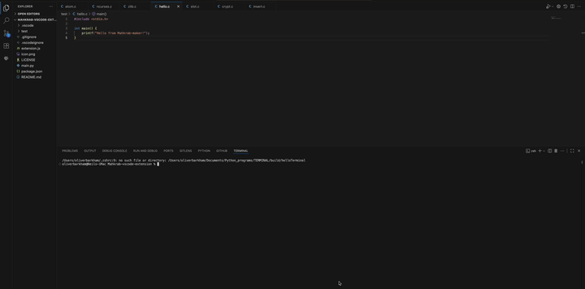

# Mahkrab-vscode-extension

Visual-studio-code extension to create `"compile and run"` `("CAR")` commands for any `C` file, whilst linking the required dependencies, to prevent typing out flags each time when needing to run multiple different `C` files.

## How it works:
>* Reads the current active file from `vscode`.
>* Checks whether file is `C` language.
>* If file has changes from last file read:
>>* File will be read for dependencies which are recognised in the extensions library (will be updated over time).
>* Any dependencies that are found by the extension will then be linked to the `"CAR"` command.
>* extension then links with the `"Code Runner"` extension to configure the `"code-runner.executorMap"` in the user's `settings.json` file:
```json
    "code-runner.executorMap": {
        "c": "cd $dir && mkdir -p build && gcc $fileName -o build/$fileNameWithoutExt -lncurses && ./build/$fileNameWithoutExt"
    }
```
>*  Now, when user presses the run button (top right), or the shortcut, usually `ctrl + option + N`, the current `C` file will be run with the dependencies needed added to the `"CAR"` command.

## Example:




[](https://marketplace.visualstudio.com/items?itemName=olibark.mahkrab-maker)
[](https://marketplace.visualstudio.com/items?itemName=olibark.mahkrab-maker)
[](https://marketplace.visualstudio.com/items?itemName=olibark.mahkrab-maker&ssr=false#review-details)
